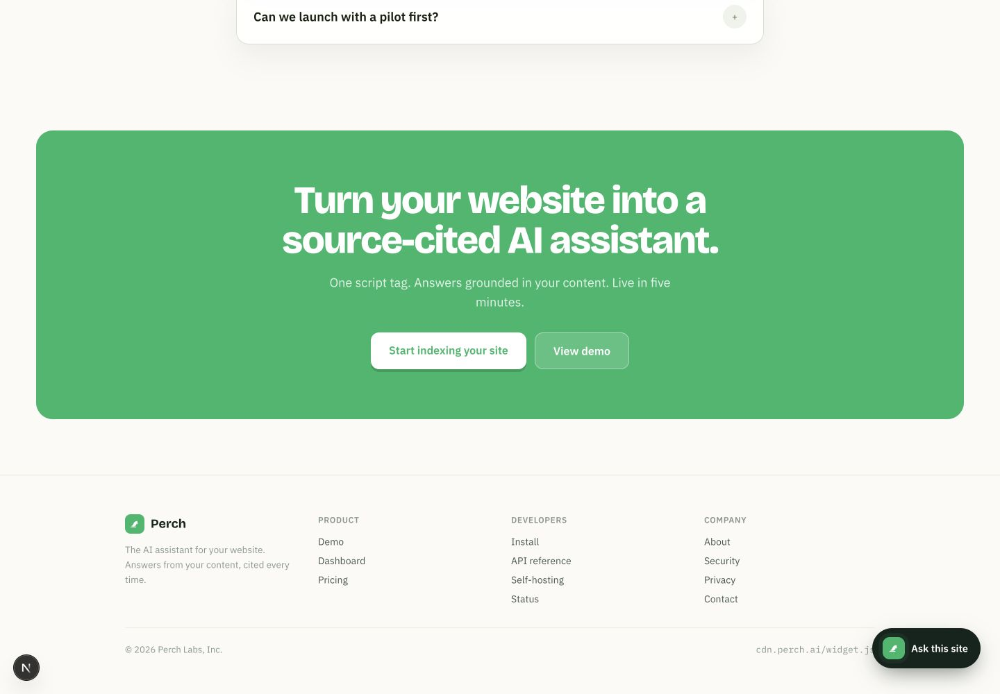
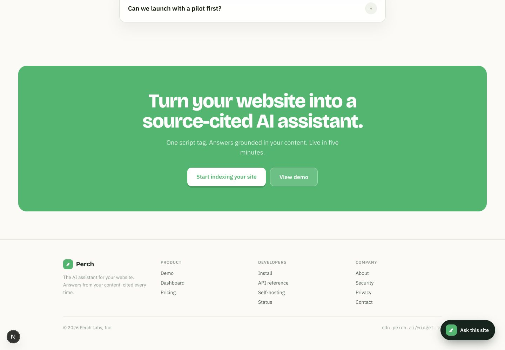
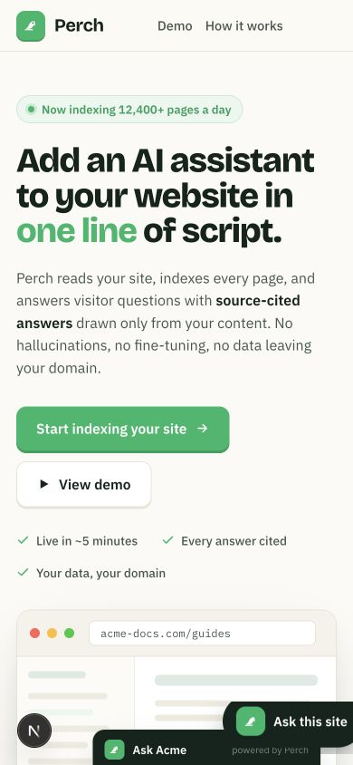
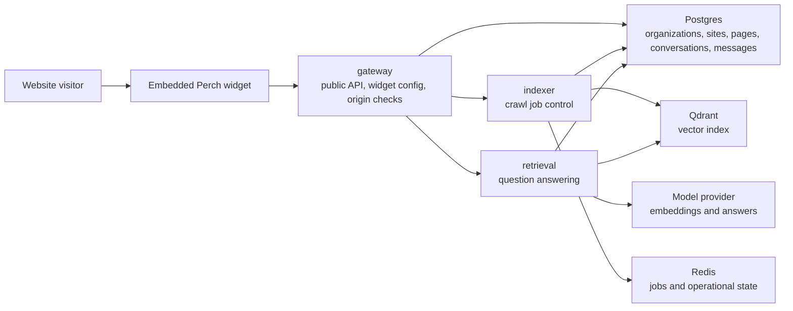
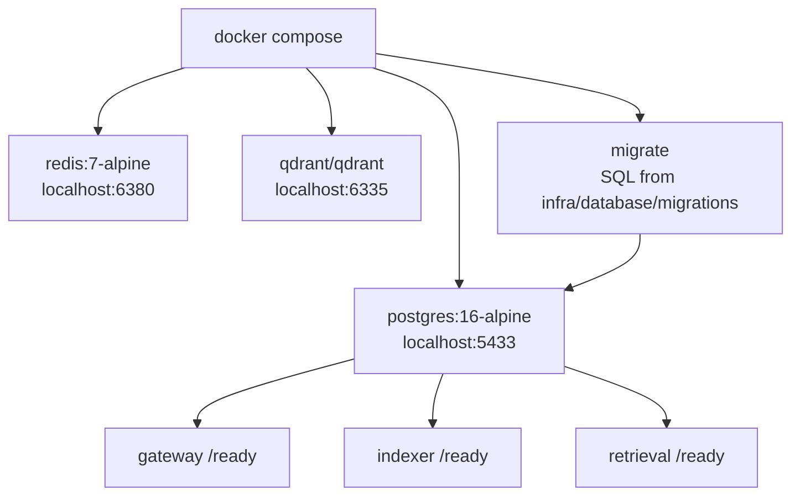

# Perch

[](https://github.com/Hqzdev/Perch/actions/workflows/ci.yml)

Perch is a drop-in AI assistant for websites. Add one script tag, crawl the site, and give visitors answers grounded in the site's own content with cited source links.

Perch is built around one narrow promise: visitors should be able to ask a website what it already says, and every useful answer should point back to the page that supports it.

## Screenshots







## Status

Perch is a portfolio-grade SaaS architecture prototype. It is designed to show clean service boundaries, a working local demo, and honest RAG product mechanics without pretending to be production infrastructure.

Implemented today:

- Next.js product site with an embedded widget demo
- Rust Gateway, Indexer, and Retrieval services
- Postgres-backed organizations, sites, pages, chunks, crawl jobs, conversations, and messages
- site creation and widget config resolved by public widget key
- single-page crawl jobs with persisted status
- direct page ingestion for deterministic demos
- retrieval over indexed Postgres chunks with source citations
- Docker Compose local stack
- CI for Rust, web build, and Compose config

Intentionally not production-ready yet:

- no production auth or billing
- no async Redis worker loop for crawl jobs
- no Qdrant vector search in the answer path yet
- no external LLM call in the default demo
- permissive local CORS for development

This tradeoff is deliberate. The project is meant to be reviewable, runnable, and architecturally credible before adding heavier AI/provider infrastructure.

## Portfolio Demo

Start the local stack:

```sh
docker compose up --build -d
```

Run the end-to-end demo:

```sh
./scripts/portfolio-demo.sh
```

The script creates a site, indexes one page through Gateway, asks a widget question, and prints the cited answer.

See [docs/demo.md](docs/demo.md) for the exact flow.

## Product Scope

Perch V1 focuses on public website pages:

- crawl allowed HTML pages from a customer domain
- extract clean page text
- chunk and embed website content
- retrieve relevant source chunks for visitor questions
- stream answers through an embeddable widget
- show citations linked to source pages
- isolate each customer by tenant and allowed domains

Out of scope for V1:

- private authenticated docs
- PDF ingestion
- Notion, Slack, Drive, or arbitrary document sources
- local ML inference
- custom vector index implementation
- billing and subscription logic
- Kubernetes production deployment

## Repository Layout

```txt
apps/
  web/          Next.js marketing site and dashboard preview
  widget/       framework-free embeddable widget

services/
  gateway/      edge API, tenant auth, widget config, rate limits
  indexer/      crawl jobs, extraction, chunking, embedding, upsert
  retrieval/    search, rerank, prompt assembly, streamed answers

crates/
  rag-core/     shared pure RAG logic
  perch-types/  shared contracts and identifiers
  perch-config/ shared configuration loading
  perch-storage/   shared Postgres pool and readiness helpers

infra/          local and deployment infrastructure
docs/           architecture, security, development, and API notes
scripts/        repeatable demo and maintenance scripts
```

## Architecture

Perch uses three service boundaries because the workloads are different:

- `gateway` handles low-latency public API and widget traffic.
- `indexer` handles long-running crawl and indexing jobs.
- `retrieval` handles latency-sensitive question answering.

Inside each Rust service, the intended structure is clean/hexagonal:

- `domain` contains business entities and rules.
- `application` contains use cases.
- `infrastructure` contains Postgres, Redis, Qdrant, model provider, crawler, and HTTP clients.
- `interfaces` contains HTTP handlers and queue consumers.

See [docs/architecture.md](docs/architecture.md) for the full boundary rules.

### Runtime Flow



Current implemented path:

```txt
gateway /v1/sites/:siteId/crawl-jobs
  -> indexer /v1/crawl/jobs
  -> fetch one public HTML page
  -> Postgres crawl_jobs, site_pages, page_chunks

gateway /v1/sites/:siteId/pages
  -> indexer /v1/index/pages
  -> Postgres site_pages and page_chunks

Next.js demo widget
  -> gateway /v1/widget/config
  -> gateway /v1/widget/chat
  -> retrieval /v1/answer
  -> Postgres page_chunks keyword lookup
  -> Postgres conversations and messages
  -> sourced answer when chunks exist
```

Next production path:

```txt
site URL
  -> gateway
  -> Redis crawl queue
  -> indexer worker
  -> sitemap and robots policy
  -> embeddings
  -> Qdrant vectors

widget question
  -> gateway
  -> retrieval
  -> tenant-filtered chunks from Postgres and Qdrant
  -> cited answer
  -> widget
```

### Local Infra



## Web App

The current implemented app is the Perch website in `apps/web`.

```sh
cd apps/web
npm install
npm run dev
```

Build:

```sh
cd apps/web
npm run build
```

To connect the demo widget to a local Gateway, set:

```sh
NEXT_PUBLIC_PERCH_GATEWAY_URL=http://localhost:18080
NEXT_PUBLIC_PERCH_WIDGET_KEY=pk_dev_replace_after_running_demo
```

## Rust Workspace

Check the backend workspace:

```sh
cargo check --workspace
```

Current services:

- `perch-gateway`
- `perch-indexer`
- `perch-retrieval`

Each service exposes a minimal `/health` endpoint and is ready for the first real application use cases.

Current backend product endpoints:

```txt
POST /v1/sites
POST /v1/sites/:siteId/pages
POST /v1/sites/:siteId/crawl-jobs
GET  /v1/sites/:siteId/crawl-jobs/:jobId
GET  /v1/widget/config
POST /v1/widget/chat
POST /v1/answer
```

## Local Infrastructure

Start Postgres, Redis, Qdrant, and the three Rust services:

```sh
docker compose up --build
```

Health endpoints:

```txt
http://localhost:18080/health
http://localhost:18081/health
http://localhost:18082/health
http://localhost:6335/readyz
```

Gateway is exposed on `localhost:18080`, indexer on `localhost:18081`, retrieval on `localhost:18082`, Postgres on `localhost:5433`, Redis on `localhost:6380`, and Qdrant on `localhost:6335` by default to avoid colliding with common local services.

## Quality Gates

Run the same checks as CI:

```sh
cargo fmt --all -- --check
cargo check --workspace
cd apps/web && npm ci && npm run build
docker compose config
```

## Roadmap

See [ROADMAP.md](ROADMAP.md).

## Security

Perch is a security-sensitive product because it embeds on customer sites and handles customer content. Report vulnerabilities through GitHub private vulnerability reporting when available. See [SECURITY.md](SECURITY.md).

## Contributing

Read [CONTRIBUTING.md](CONTRIBUTING.md) before opening issues or pull requests.

## License

MIT. See [LICENSE](LICENSE).
