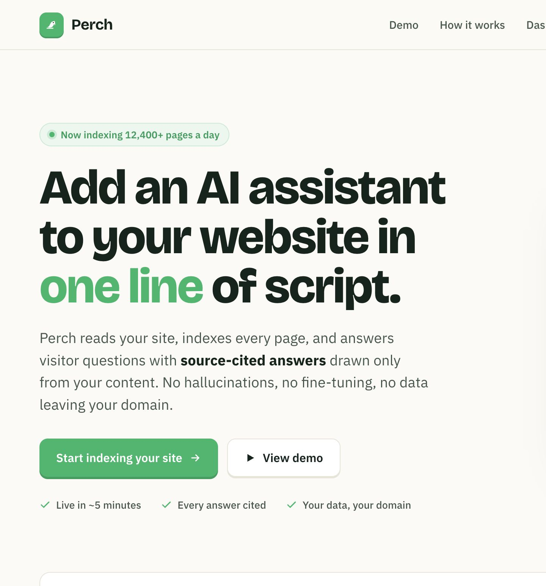
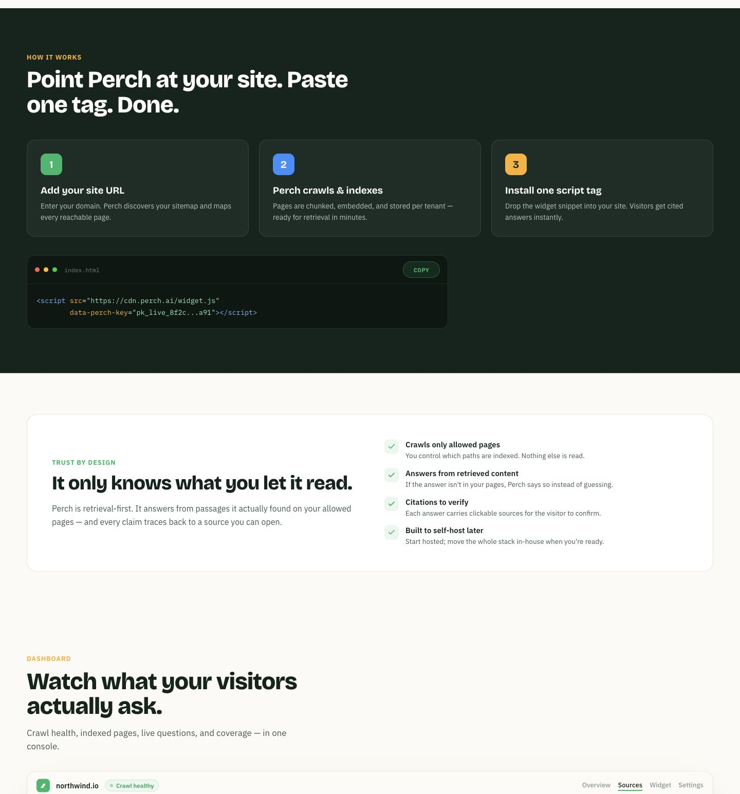
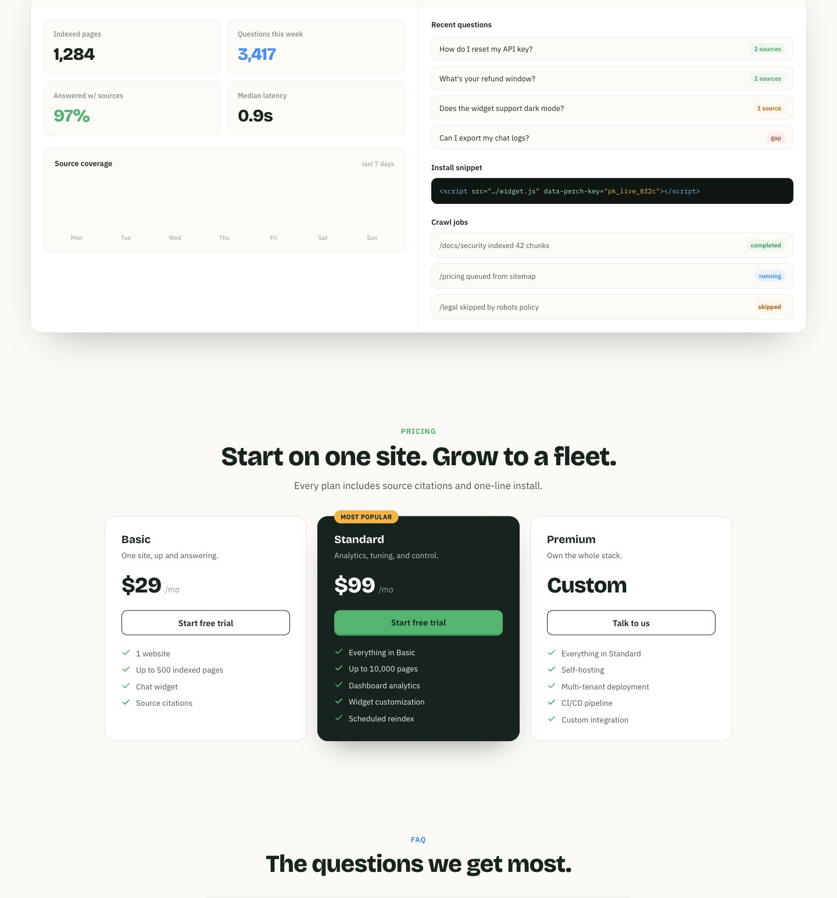
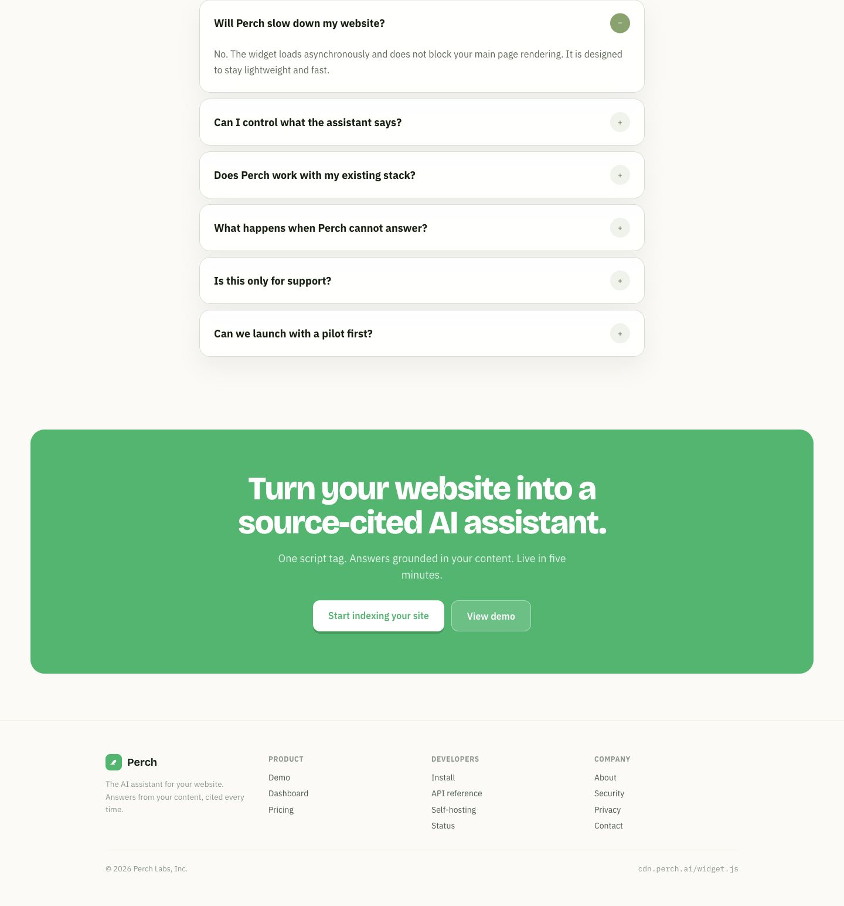
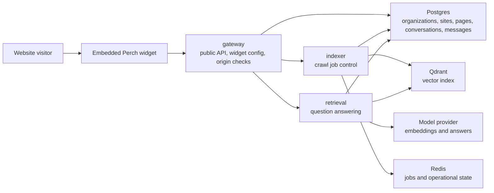
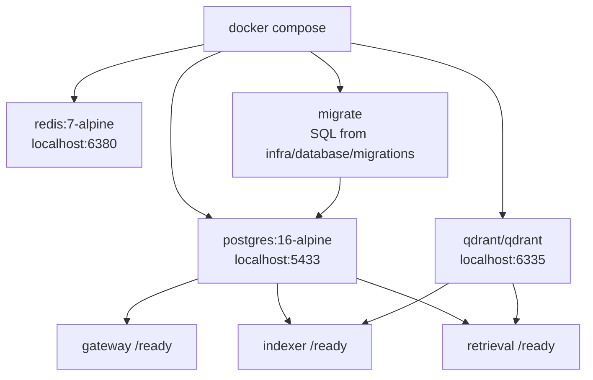

# Perch

[](https://github.com/Hqzdev/Perch/actions/workflows/ci.yml)

Perch is a drop-in AI assistant for websites. Add one script tag, crawl the site, and give visitors answers grounded in the site's own content with cited source links.

Perch is built around one narrow promise: visitors should be able to ask a website what it already says, and every useful answer should point back to the page that supports it.

## Screenshots

Hero and value proposition:



How it works, install snippet, and trust model:



Dashboard, source coverage, and pricing:



FAQ, final CTA, and footer:



## Tech Stack

| Layer | Technologies |
| --- | --- |
| Frontend | Next.js, React, TypeScript, CSS |
| Widget | Framework-free JavaScript, Shadow DOM, script tag embed |
| Backend | Rust, Axum, Tokio, Reqwest |
| Data | Postgres, Redis, Qdrant |
| RAG | deterministic embeddings for local demos, Qdrant vector search, Postgres keyword fallback, source citations |
| LLM | optional OpenAI-compatible chat completion provider, disabled by default |
| Infrastructure | Docker Compose, service-specific Dockerfiles, Postgres/Redis/Qdrant configs, SQL migrations |
| Quality | Rust workspace checks, Next.js production build, Docker Compose validation, end-to-end smoke test, GitHub Actions CI |

## Status

Perch is a portfolio-grade SaaS architecture prototype. It is designed to show clean service boundaries, a working local demo, and honest RAG product mechanics without pretending to be production infrastructure.

Implemented today:

- Next.js product site with an embedded widget demo
- Next.js dashboard preview for site owners, install snippets, indexed pages, and conversations
- Rust Gateway, Indexer, and Retrieval services
- Postgres-backed organizations, sites, pages, chunks, crawl jobs, conversations, and messages
- site creation and widget config resolved by public widget key
- standalone framework-free widget script served by Gateway
- single-page crawl jobs with persisted status
- direct page ingestion for deterministic demos
- retrieval over Qdrant vectors with Postgres keyword fallback and source citations
- optional OpenAI-compatible LLM generation with deterministic fallback
- Docker Compose local stack
- CI for Rust, web build, and Compose config

Intentionally not production-ready yet:

- no production auth or billing
- no async Redis worker loop for crawl jobs
- no external LLM call in the default demo unless `PERCH_LLM_PROVIDER=openai` is configured
- permissive local CORS for development

This tradeoff is deliberate. The project is meant to be reviewable, runnable, and architecturally credible before adding heavier provider infrastructure.

## Portfolio Demo

Run the backend stack:

```sh
docker compose up --build -d
```

Verify the product flow:

```sh
./scripts/smoke-test.sh
```

Run the web app:

```sh
cd apps/web
npm install
npm run dev
```

Open:

```txt
http://localhost:3000
http://localhost:3000/dashboard
http://localhost:3000/widget-demo?key=pk_dev_...
```

For a printed backend walkthrough, run:

```sh
./scripts/portfolio-demo.sh
```

The smoke test checks readiness, creates a tenant site, indexes a page, verifies Qdrant points, calls widget chat, and fails if the answer does not include a source citation. The portfolio demo script prints the same flow as a readable walkthrough.

See [docs/demo.md](docs/demo.md) for the exact flow.

## Product Scope

Perch V1 focuses on public website pages:

- crawl allowed HTML pages from a customer domain
- extract clean page text
- chunk and embed website content
- retrieve relevant source chunks for visitor questions
- answer questions through an embeddable widget
- show citations linked to source pages
- isolate each customer by tenant and allowed domains

Out of scope for V1:

- private authenticated docs
- PDF ingestion
- Notion, Slack, Drive, or arbitrary document sources
- local ML inference
- custom vector index implementation
- billing and subscription logic
- Kubernetes production deployment

## Repository Layout

```txt
apps/
  web/          Next.js marketing site and dashboard preview
  widget/       framework-free embeddable widget

services/
  gateway/      edge API, tenant auth, widget config, rate limits
  indexer/      crawl jobs, extraction, chunking, embedding, upsert
  retrieval/    search, rerank, prompt assembly, streamed answers

crates/
  rag-core/     shared pure RAG logic
  perch-types/  shared contracts and identifiers
  perch-config/ shared configuration loading
  perch-storage/   shared Postgres pool and readiness helpers

infra/          local and deployment infrastructure
docs/           architecture, security, development, and API notes
scripts/        repeatable demo and maintenance scripts
```

## Architecture

Perch uses three service boundaries because the workloads are different:

- `gateway` handles low-latency public API and widget traffic.
- `indexer` handles long-running crawl and indexing jobs.
- `retrieval` handles latency-sensitive question answering.

Inside each Rust service, the intended structure is clean/hexagonal:

- `domain` contains business entities and rules.
- `application` contains use cases.
- `infrastructure` contains Postgres, Redis, Qdrant, model provider, crawler, and HTTP clients.
- `interfaces` contains HTTP handlers and queue consumers.

See [docs/architecture.md](docs/architecture.md) for the full boundary rules.

### Runtime Flow



Current implemented path:

```txt
gateway /v1/sites/:siteId/crawl-jobs
  -> indexer /v1/crawl/jobs
  -> fetch one public HTML page
  -> Postgres crawl_jobs, site_pages, page_chunks
  -> Qdrant perch_chunks vectors

gateway /v1/sites/:siteId/pages
  -> indexer /v1/index/pages
  -> Postgres site_pages and page_chunks
  -> Qdrant perch_chunks vectors

Standalone script widget
  -> gateway /widget/perch.js
  -> gateway /v1/widget/config
  -> gateway /v1/widget/chat
  -> retrieval /v1/answer
  -> Qdrant vector search
  -> Postgres page_chunks keyword fallback
  -> optional OpenAI-compatible LLM answer generation
  -> Postgres conversations and messages
  -> sourced answer when chunks exist
```

Next production path:

```txt
site URL
  -> gateway
  -> Redis crawl queue
  -> indexer worker
  -> sitemap and robots policy
  -> provider embeddings
  -> Qdrant vectors

widget question
  -> gateway
  -> retrieval
  -> tenant-filtered chunks from Qdrant
  -> optional provider-generated answer
  -> cited answer
  -> widget
```

### Local Infra



## Web App

The current implemented app is the Perch website in `apps/web`.

```sh
cd apps/web
npm install
npm run dev
```

Build:

```sh
cd apps/web
npm run build
```

To connect the demo widget to a local Gateway, set:

```sh
NEXT_PUBLIC_PERCH_GATEWAY_URL=http://localhost:18080
NEXT_PUBLIC_PERCH_WIDGET_KEY=pk_dev_replace_after_running_demo
```

The dashboard preview is available at:

```txt
http://localhost:3000/dashboard
```

The standalone widget demo page is available after creating a site and copying its public widget key:

```txt
http://localhost:3000/widget-demo?key=pk_dev_...
```

It reads Gateway dashboard endpoints directly. It is intentionally a dev dashboard, not production auth; the next production step is real organization membership and session-backed access control.

Owner routes require a development owner token:

```sh
PERCH_OWNER_TOKEN=perch_dev_owner_token
```

Send it as `x-perch-owner-token` or `Authorization: Bearer ...`. Widget config and chat remain public but origin-checked.

## Rust Workspace

Check the backend workspace:

```sh
cargo check --workspace
```

Current services:

- `perch-gateway`
- `perch-indexer`
- `perch-retrieval`

Each service exposes a minimal `/health` endpoint and is ready for the first real application use cases.

Readiness is dependency-aware. Gateway requires Postgres. Indexer and Retrieval require Postgres plus Qdrant when `PERCH_QDRANT_ENABLED=true`; if Qdrant is disabled, it is reported as `configured`.

Current backend product endpoints:

```txt
GET  /widget/perch.js
GET  /v1/sites
POST /v1/sites
GET  /v1/sites/:siteId
GET  /v1/sites/:siteId/pages
POST /v1/sites/:siteId/pages
GET  /v1/sites/:siteId/conversations
POST /v1/sites/:siteId/crawl-jobs
GET  /v1/sites/:siteId/crawl-jobs/:jobId
GET  /v1/widget/config
POST /v1/widget/chat
POST /v1/answer
```

## Local Infrastructure

Start Postgres, Redis, Qdrant, and the three Rust services:

```sh
docker compose up --build
```

Health endpoints:

```txt
http://localhost:18080/health
http://localhost:18081/health
http://localhost:18082/health
http://localhost:6335/readyz
```

Gateway is exposed on `localhost:18080`, indexer on `localhost:18081`, retrieval on `localhost:18082`, Postgres on `localhost:5433`, Redis on `localhost:6380`, and Qdrant on `localhost:6335` by default to avoid colliding with common local services.

Default local mode is deterministic and does not require provider keys:

```sh
PERCH_QDRANT_ENABLED=true
PERCH_QDRANT_COLLECTION=perch_chunks
PERCH_LLM_PROVIDER=disabled
```

Enable OpenAI-compatible answer generation only when you want the final wording drafted by an LLM:

```sh
PERCH_LLM_PROVIDER=openai
PERCH_LLM_MODEL=gpt-4o-mini
PERCH_LLM_API_KEY=sk_...
PERCH_LLM_BASE_URL=https://api.openai.com/v1
```

Retrieval still uses indexed source chunks and returns citations. The LLM layer changes answer wording, not tenant isolation or source grounding.

The Compose stack runs backend services with `RUST_LOG=info`, so indexing, vector projection, retrieval path selection, and LLM fallback decisions are visible through:

```sh
docker compose logs indexer retrieval
```

## Quality Gates

Run the same checks as CI:

```sh
cargo fmt --all -- --check
cargo check --workspace
(cd apps/web && npm ci && npm run build)
docker compose config
./scripts/smoke-test.sh
```

## Roadmap

See [ROADMAP.md](ROADMAP.md).

## Security

Perch is a security-sensitive product because it embeds on customer sites and handles customer content. Report vulnerabilities through GitHub private vulnerability reporting when available. See [SECURITY.md](SECURITY.md).

## Contributing

Read [CONTRIBUTING.md](CONTRIBUTING.md) before opening issues or pull requests.

## License

MIT. See [LICENSE](LICENSE).
