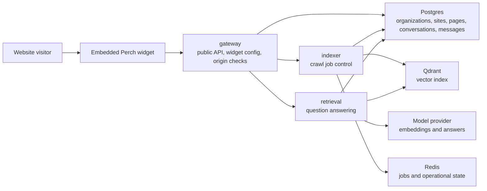
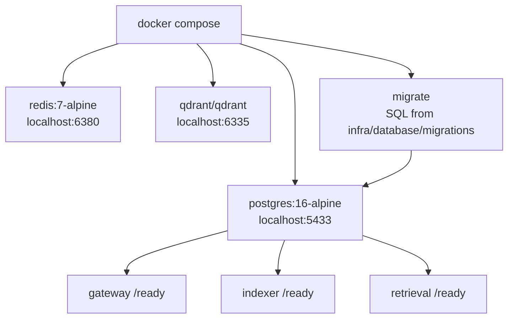

# Perch

Perch is a drop-in AI assistant for websites. Add one script tag, crawl the site, and give visitors answers grounded in the site's own content with cited source links.

Perch is built around one narrow promise: visitors should be able to ask a website what it already says, and every useful answer should point back to the page that supports it.

## Status

Perch is in early product development. The repository currently contains the web marketing app, a compilable Rust workspace, shared crates, and minimal service entrypoints for the backend boundaries.

Do not treat the project as production-ready yet. The current priority is a working Tier A demo: crawl one website, index pages, embed a framework-free widget, stream cited answers, and show indexing state in a dashboard.

## Product Scope

Perch V1 focuses on public website pages:

- crawl allowed HTML pages from a customer domain
- extract clean page text
- chunk and embed website content
- retrieve relevant source chunks for visitor questions
- stream answers through an embeddable widget
- show citations linked to source pages
- isolate each customer by tenant and allowed domains

Out of scope for V1:

- private authenticated docs
- PDF ingestion
- Notion, Slack, Drive, or arbitrary document sources
- local ML inference
- custom vector index implementation
- billing and subscription logic
- Kubernetes production deployment

## Repository Layout

```txt
apps/
  web/          Next.js marketing site and dashboard preview
  widget/       framework-free embeddable widget

services/
  gateway/      edge API, tenant auth, widget config, rate limits
  indexer/      crawl jobs, extraction, chunking, embedding, upsert
  retrieval/    search, rerank, prompt assembly, streamed answers

crates/
  rag-core/     shared pure RAG logic
  perch-types/  shared contracts and identifiers
  perch-config/ shared configuration loading

infra/          local and deployment infrastructure
docs/           architecture, security, development, and API notes
```

## Architecture

Perch uses three service boundaries because the workloads are different:

- `gateway` handles low-latency public API and widget traffic.
- `indexer` handles long-running crawl and indexing jobs.
- `retrieval` handles latency-sensitive question answering.

Inside each Rust service, the intended structure is clean/hexagonal:

- `domain` contains business entities and rules.
- `application` contains use cases.
- `infrastructure` contains Postgres, Redis, Qdrant, model provider, crawler, and HTTP clients.
- `interfaces` contains HTTP handlers and queue consumers.

See [docs/architecture.md](docs/architecture.md) for the full boundary rules.

### Runtime Flow



Current implemented path:

```txt
Next.js demo widget
  -> gateway /v1/widget/config
  -> gateway /v1/widget/chat
  -> retrieval /v1/answer
  -> Postgres conversations and messages
  -> deterministic bootstrap answer
```

Next backend path:

```txt
widget question
  -> gateway
  -> retrieval
  -> tenant-filtered chunks from Postgres and Qdrant
  -> cited answer
  -> widget
```

### Local Infra



## Web App

The current implemented app is the Perch website in `apps/web`.

```sh
cd apps/web
npm install
npm run dev
```

Build:

```sh
cd apps/web
npm run build
```

## Rust Workspace

Check the backend workspace:

```sh
cargo check --workspace
```

Current services:

- `perch-gateway`
- `perch-indexer`
- `perch-retrieval`

Each service exposes a minimal `/health` endpoint and is ready for the first real application use cases.

## Local Infrastructure

Start Postgres, Redis, Qdrant, and the three Rust services:

```sh
docker compose up --build
```

Health endpoints:

```txt
http://localhost:18080/health
http://localhost:18081/health
http://localhost:18082/health
http://localhost:6335/readyz
```

Gateway is exposed on `localhost:18080`, indexer on `localhost:18081`, retrieval on `localhost:18082`, Postgres on `localhost:5433`, Redis on `localhost:6380`, and Qdrant on `localhost:6335` by default to avoid colliding with common local services.

## Roadmap

See [ROADMAP.md](ROADMAP.md).

## Security

Perch is a security-sensitive product because it embeds on customer sites and handles customer content. Report vulnerabilities through GitHub private vulnerability reporting when available. See [SECURITY.md](SECURITY.md).

## Contributing

Read [CONTRIBUTING.md](CONTRIBUTING.md) before opening issues or pull requests.

## License

MIT. See [LICENSE](LICENSE).
